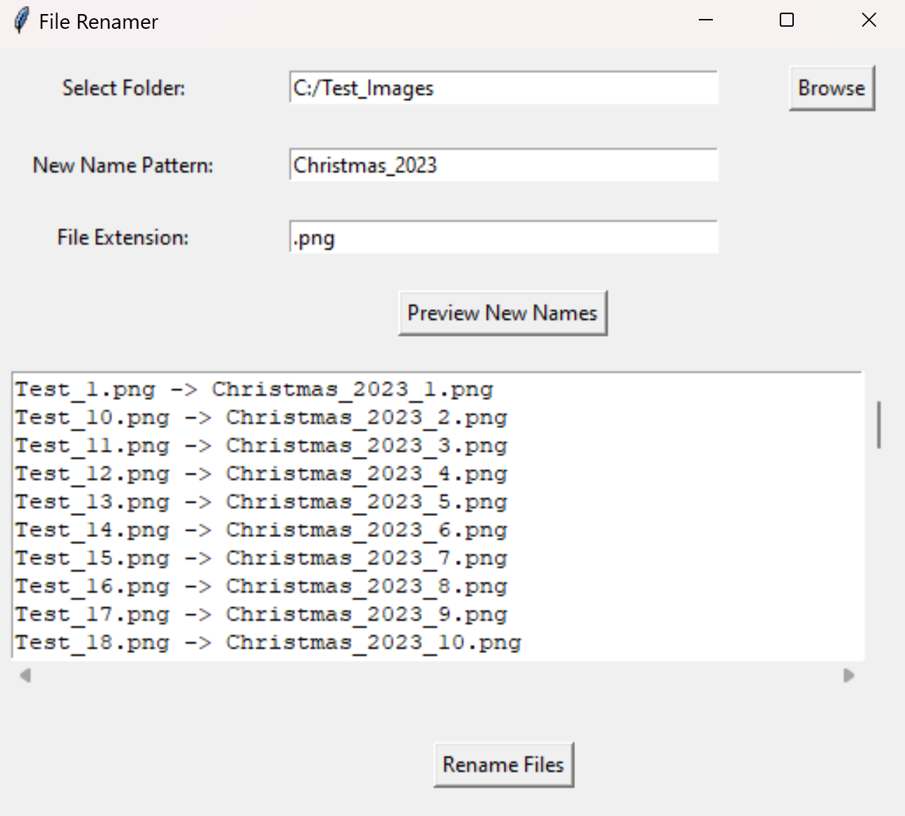

# File Renamer

A simple Python-based GUI tool that allows users to rename multiple files at once. The tool is built using the tkinter library and is designed to be user-friendly. It provides options to preview the new filenames before applying the changes and handles common errors like duplicate filenames.



## Installation
1. Clone the repository:
    ```sh
    git clone https://github.com/sixthnovember/File-Renamer.git
    cd File-Renamer
    ```
2. Install the required packages:
    ```sh
    pip install -r requirements.txt
    ```
3. Run the script using Python:
    ```bash
    python renamer.py
    ```

## Usage
1. Select Folder: Click the "Browse" button to select the folder containing the files you want to rename.
2. New Name Pattern: Enter the new name pattern for the files (e.g., image, document).
3. File Extension: Specify the file extension (e.g., .png, .txt). Only files with this extension will be renamed.
4. Preview: Click "Preview New Names" to see how the files will be renamed.
5. Rename Files: If the preview looks good, click "Rename Files" to apply the changes.